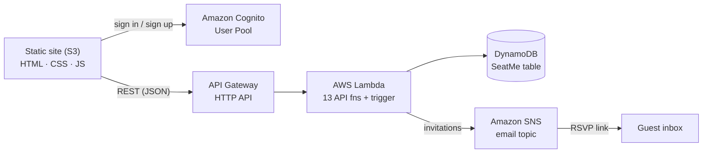

# SeatMe

> Plan your event seating in minutes — collect RSVPs, organise guests, and generate smart seating arrangements.


SeatMe is a cloud-based, fully serverless event manager. Hosts sign in, create an
event, add guests, collect RSVPs through a personal link, and let the app build a
seating plan that keeps related groups together — all running on AWS managed services
with no servers to maintain.

---

## Table of contents

- [Features](#features)
- [Architecture](#architecture)
- [Project structure](#project-structure)
- [Quick start](#quick-start)
- [Tech stack](#tech-stack)
- [Documentation](#documentation)
- [Roadmap](#roadmap)

---

## Features

- **Host accounts** — email/password sign-up, email verification, and password reset via Amazon Cognito.
- **Event management** — create one event per host with name, date, and location.
- **Guest list** — add guests, group them into categories, and track party sizes.
- **RSVP** — every guest gets a personal link to confirm attendance, party size, and a song request.
- **Tables & seating** — define tables with capacities and auto-generate a seating plan that seats confirmed guests and keeps categories together.
- **Invitations** — email guests their RSVP link (single guest or the whole list) through Amazon SNS.

See [docs/features.md](docs/features.md) for the full feature walkthrough.

---

## Architecture

SeatMe is a single-page-per-screen static frontend talking to an HTTP API backed by
Lambda functions and a single DynamoDB table.



**Data model** — one DynamoDB item per host (partition key `email`). Guests and tables
are stored as nested maps inside the host item, so a single read returns everything
needed to render a screen. Full details in [docs/architecture.md](docs/architecture.md).

---

## Project structure

```text
SeatMe/
├── README.md
├── requirements.txt                # boto3 (deploy scripts + Lambda runtime)
├── redeploy_all.py                 # one-command deploy / teardown orchestrator
├── backend/
│   ├── lambdas/                    # 13 API handlers + Cognito trigger + shared helper
│   │   ├── add_host.py   get_host.py   update_host.py   delete_host.py
│   │   ├── add_guest.py  get_guests.py update_guest.py  delete_guest.py
│   │   ├── rsvp_guest.py set_tables.py generate_seating.py
│   │   ├── send_invitation.py
│   │   ├── list_hosts.py           # admin-only: list all events
│   │   ├── auth_post_confirmation.py  # Cognito trigger: add sign-ups to 'host' group
│   │   └── _common.py              # shared auth/ownership helper (bundled into each zip)
│   └── deploy/                     # AWS provisioning + seed scripts
│       ├── setup_aws.py            # Lambda functions + HTTP API Gateway
│       ├── setup_cognito.py        # Cognito user pool + client + groups + seed users
│       └── seed_example.py         # demo data (host + 50 guests)
├── frontend/                       # static site (vanilla HTML/CSS/JS)
│   ├── index.html  login.html  signup.html  forgot.html
│   ├── create-host.html  host.html  guest.html  rsvp.html  admin.html
│   ├── app.css  api.js
│   └── deploy_frontend.py          # uploads the site to S3 + injects config
└── docs/
    ├── architecture.md  api.md  features.md  installation.md
```

---

## Quick start

> Designed for the **AWS Academy Learner Lab** (region `us-east-1`), but works in any
> AWS account whose execution role can manage DynamoDB, Lambda, API Gateway, Cognito,
> SNS, and S3.

1. Start the lab / open the AWS Console and launch **CloudShell**.
2. Clone the repository and enter it:
   ```bash
   git clone <your-repo-url> SeatMe
   cd SeatMe
   ```
3. Deploy the whole stack with one command:
   ```bash
   python3 redeploy_all.py --seed
   ```
   This creates the DynamoDB table, deploys the Lambdas + API Gateway, sets up Cognito,
   loads demo data, and uploads the frontend to S3. The **Website URL** is printed at the end.

Common variations:

| Command | What it does |
| --- | --- |
| `python3 redeploy_all.py` | Deploy without demo data |
| `python3 redeploy_all.py --seed` | Deploy and load a demo host + 50 guests |
| `python3 redeploy_all.py --clean --yes` | Delete everything, then redeploy from scratch |
| `python3 redeploy_all.py --teardown --yes` | Remove all AWS resources |

Full step-by-step instructions (including the manual, script-by-script flow) are in
[docs/installation.md](docs/installation.md).

### Run the frontend locally

The frontend is static, so you can preview it without AWS (API calls will be inert until
deployed):

```bash
python3 -m http.server 3000 --directory frontend
# open http://localhost:3000
```

---

## Tech stack

| Layer | Technology |
| --- | --- |
| Frontend | HTML, CSS, vanilla JavaScript (no build step) |
| Hosting | Amazon S3 static website |
| Auth | Amazon Cognito User Pools (`USER_PASSWORD_AUTH`) |
| API | Amazon API Gateway (HTTP API) |
| Compute | AWS Lambda (Python 3.12) |
| Database | Amazon DynamoDB (single-table design) |
| Email | Amazon SNS (invitations) · Amazon SES (optional, Cognito emails) |
| Tooling | Python 3.12, boto3 |

---

## Documentation

| Document | Contents |
| --- | --- |
| [docs/installation.md](docs/installation.md) | Deploy, redeploy, and teardown — one command or step by step |
| [docs/architecture.md](docs/architecture.md) | System design, data model, request flow, seating algorithm |
| [docs/api.md](docs/api.md) | Complete REST API reference with request/response examples |
| [docs/features.md](docs/features.md) | Feature walkthrough and user journeys |

---

## Roadmap

- Move write-endpoint token validation to a Cognito JWT authorizer on API Gateway (today
  each protected Lambda validates the access token and ownership itself).
- Replace SNS invitations with Amazon SES for one-click delivery (no subscribe step).
- Drag-and-drop seating editor.
- Guest-facing event page with directions and schedule.

---

<sub>Built as an AWS serverless learning project. Region: `us-east-1`.</sub>
