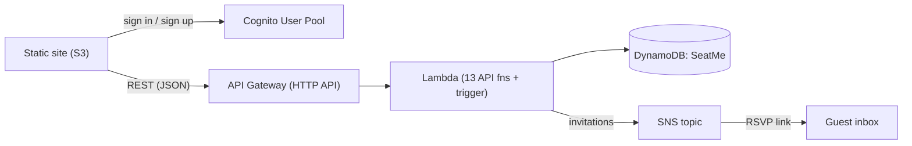
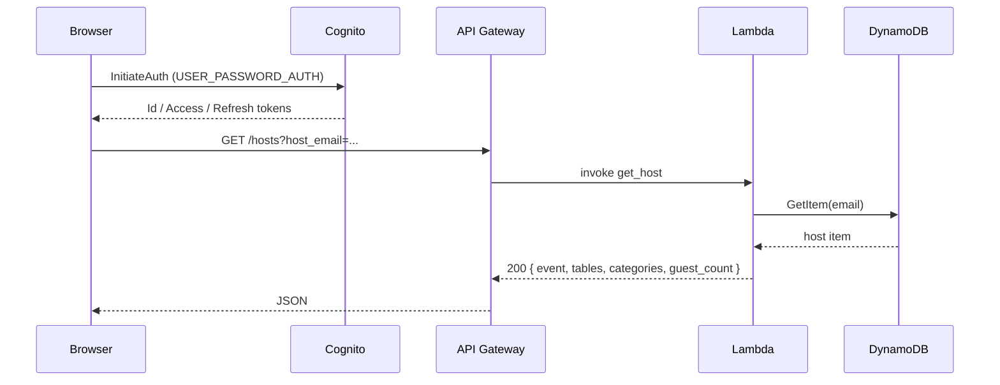
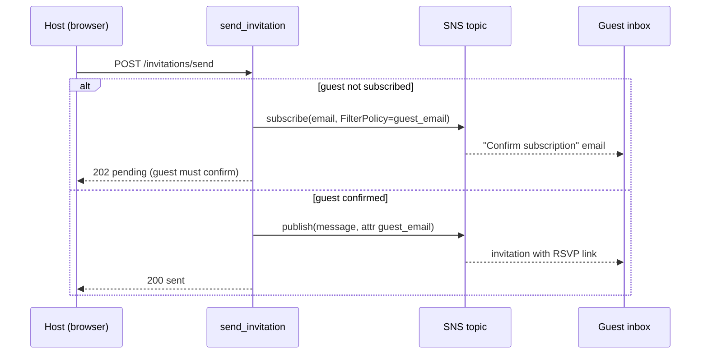

# Architecture

SeatMe is a fully serverless application. Every component is an AWS managed service,
so there are no servers to provision or patch and the app scales to zero when idle.

## Components

| Component | Service | Responsibility |
| --- | --- | --- |
| Frontend | Amazon S3 (static website) | Serves the HTML/CSS/JS screens |
| Auth | Amazon Cognito User Pool | Host sign-up, email verification, sign-in, password reset |
| API | Amazon API Gateway (HTTP API) | Routes JSON requests to Lambda functions |
| Compute | AWS Lambda (Python 3.12) | 13 API functions (one per operation) + a Cognito Post-Confirmation trigger (`auth_post_confirmation`); each validates input and updates data |
| Database | Amazon DynamoDB | Single table, host-centric design |
| Email | Amazon SNS | Sends guests their personal RSVP link |

## High-level flow



The browser authenticates **directly** against Cognito (the `cognito-idp` JSON API)
and stores the returned tokens in `localStorage`. It then calls API Gateway for all
data operations. Cognito and API Gateway are independent — see
[Security notes](#security-notes).

---

## Data model

SeatMe uses a **single-table, host-centric design**. The table is named `SeatMe`
with a single partition key `email` (the host's email). Everything about an event —
its guests and tables — lives inside one item, so loading a host screen is a single
`GetItem`.

| Attribute | Type | Description |
| --- | --- | --- |
| `email` | String (PK) | Host email — also the Cognito username |
| `name` | String | Host's display name |
| `event_name` | String | Event title |
| `event_date` | String | `YYYY-MM-DD` |
| `event_location` | String | Free-text location |
| `categories` | List\<String> | Guest groups used by the seating algorithm |
| `tables` | Map | `{ "1": { "capacity": 10 }, ... }` |
| `guests` | Map | `{ "guest@email": { ...guest } }` |

Each **guest** entry:

| Field | Type | Description |
| --- | --- | --- |
| `name` | String | Guest's name |
| `category` | String | Which group they belong to |
| `count` | Number | People this invitation covers (party size) |
| `rsvp` | String | `yes` · `no` · `?` (pending) |
| `table` | Number \| null | Assigned table number, or `null` if unseated |
| `song` | String | Optional song request (added on RSVP) |

### Example item

```json
{
  "email": "host@example.com",
  "name": "Jane Cohen",
  "event_name": "Jane & Tom's Wedding",
  "event_date": "2026-09-15",
  "event_location": "Tel Aviv",
  "categories": ["Family", "Friends", "Work"],
  "tables": { "1": { "capacity": 10 }, "2": { "capacity": 8 } },
  "guests": {
    "daniel@example.com": {
      "name": "Daniel Levi", "category": "Family",
      "count": 2, "rsvp": "yes", "table": 1
    }
  }
}
```

> **Numbers as strings.** `get_host` and `get_guests` serialise the item with
> `json.dumps(..., default=str)`, so DynamoDB `Decimal` values (`count`, `table`,
> `capacity`) arrive at the browser as **strings**. The frontend always `parseInt`s
> them before use.

---

## Request flow

A typical "sign in and open my event" sequence:



Each Lambda is a thin handler that:
1. parses and validates the request body / query string,
2. performs one DynamoDB operation (often a conditional update),
3. returns `{ statusCode, body }` with a JSON string body.

Validation (required fields, email format, date format, positive integers) happens
inside every handler, and writes use `ConditionExpression`s to stay consistent
(e.g. "host must exist", "guest must not already exist").

---

## Seating algorithm

`generate_seating` builds a plan with a greedy, category-aware strategy:

1. **Filter** to guests who RSVP'd `yes`.
2. **Capacity check** — total party size vs. total table capacity; abort with `400`
   if there aren't enough seats.
3. **Group** confirmed guests by `category` and sort groups largest-first.
4. **Place** each group by repeatedly choosing the table with the most free seats and
   seating as many of the group's parties as fit, so members of a category stay
   together where possible.
5. **Persist** every assignment back to `guests.<email>.table` in a single update,
   clearing any stale seat from a previous run that no longer applies.

The result lists how many guests were seated and the `email → table` assignments.

---

## Invitations (SNS)

SNS has no "email one address" API, so SeatMe models invitations as topic
subscriptions:



Each guest is subscribed with a **filter policy** on their own email, and every
publish carries a matching `guest_email` message attribute — so a guest only ever
receives their own personalised link, never another guest's.

---

## Deployment model

`redeploy_all.py` is the single source of truth. It reuses the same helper modules
used for manual deploys so there is no duplicated logic:

```text
redeploy_all.py
├── backend/deploy/setup_aws.py        → Lambdas + API Gateway
├── backend/deploy/setup_cognito.py    → Cognito user pool + app client
├── backend/deploy/seed_example.py     → optional demo data
└── frontend/deploy_frontend.py        → upload site to S3 (+ inject config)
```

At deploy time, `deploy_frontend.py` injects the API URL and Cognito IDs into the
HTML/JS by replacing `REPLACE_WITH_*` placeholders, so no secrets or environment
URLs are committed to the repository.

---

## Security notes

- **Writes are authenticated and authorized** — every mutating endpoint (create / update /
  delete a host or guest, set tables, generate seating, send invitations) requires a valid
  Cognito **access token** and enforces per-event ownership (caller email == host email) or
  `admin` group membership inside the Lambda, via a shared `_common.require_owner` helper
  bundled into each function. The frontend attaches `Authorization: Bearer <access token>`
  to every write call. Direct SDK invokes with no API Gateway request context (the seed
  script) are treated as trusted server-side calls.
- **Reads stay public by design** — `get_host`, `get_guests`, and `rsvp_guest` are
  unauthenticated so the public RSVP page and the no-login preview link keep working. An
  anonymous preview is therefore **read-only**: the UI shows a banner and disables editing,
  and the server rejects any write it attempts.
- **Input validation & conditional writes** — every Lambda validates input and uses
  DynamoDB condition expressions to prevent inconsistent state; party size is capped
  (1–20) and stale seat assignments are cleared when tables or seating change.
- **XSS** — the frontend escapes all user-supplied values with `escapeHtml()` before
  inserting them into the DOM, and `500` responses no longer echo internal exception detail.
- **No secrets in the repo** — deploy-time values are injected into placeholders.
- **Roadmap** — move token validation to a Cognito **JWT authorizer** on the HTTP API so
  it happens at the gateway rather than inside each protected Lambda.
