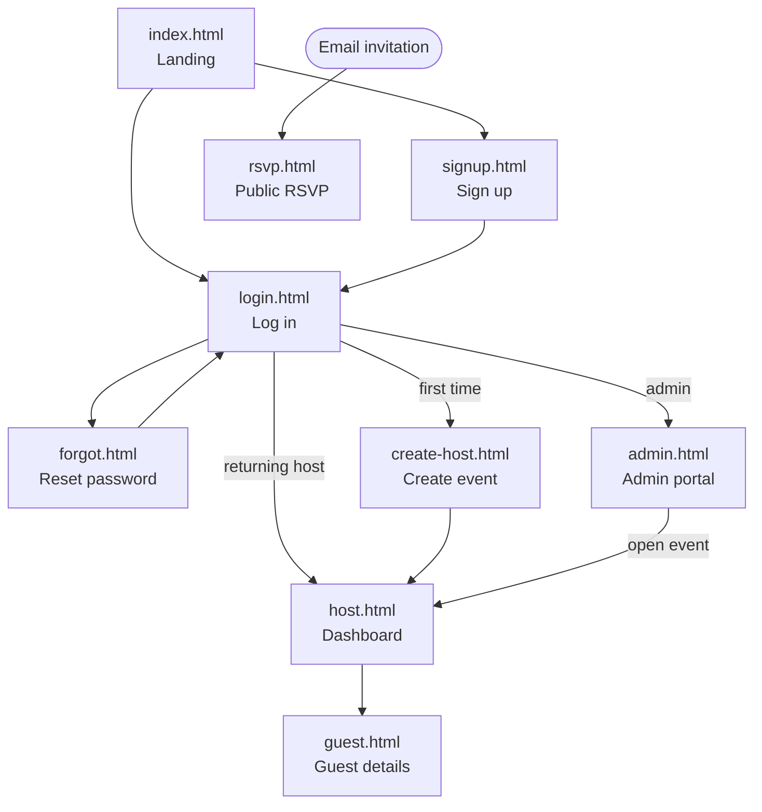

# 04 — UI Design / Wireframes

These are **design wireframes** (low-fidelity sketches), not screenshots of the running
app, as required. They show layout and intent for each screen. The implemented screens
live in [../../frontend](../../frontend).

## Screen flow



## Common layout
```
+--------------------------------------------------------------+
|  SeatMe            <event name>            [user]  [Log out]  |  <- app bar
+--------------------------------------------------------------+
|                                                              |
|   <page content>                                             |
|                                                              |
+--------------------------------------------------------------+
```

## Landing — `index.html`
```
+--------------------------------------------------------------+
|  SeatMe                                                       |
|                                                              |
|        Plan your event's guest list and seating.             |
|                                                              |
|        [ Log in ]     [ Create an account ]                  |
+--------------------------------------------------------------+
```

## Sign up — `signup.html`  (Features F01, F02)
```
+-------------------------------+      Step 2 (after submit):
|  Create your account          |      +-----------------------------+
|  Name    [______________]     |      |  Confirm your email         |
|  Email   [______________]     |      |  Code  [____-____]          |
|  Password[______________]     |      |  [ Confirm ]  [ Resend ]    |
|  [ Sign up ]                  |      +-----------------------------+
|  Already have an account? Login|
+-------------------------------+
```

## Log in — `login.html`  (Features F03, F18)
```
+-------------------------------+
|  Log in                       |
|  Email    [______________]    |
|  Password [______________]    |
|  [ Log in ]                   |
|  Forgot password?  Sign up    |
+-------------------------------+
(routes admins -> admin.html, hosts -> host.html / create-host.html)
```

## Reset password — `forgot.html`  (Feature F04)
```
+-------------------------------+
|  Reset password               |
|  Email [______________] [Send code]
|  Code  [______________]       |
|  New password [___________]   |
|  [ Set new password ]         |
+-------------------------------+
```

## Create event — `create-host.html`  (Feature F06)
```
+-------------------------------+
|  Create your event            |
|  Event name [______________]  |
|  Date       [ 2026-09-15 ]    |
|  Location   [______________]  |
|  [ Create event ]             |
+-------------------------------+
```

## Host dashboard — `host.html`  (F07-F13, F16, F17, F19)
```
+--------------------------------------------------------------+
|  SeatMe   Jane & Tom's Wedding         [Jane]  [Log out]      |
+--------------------------------------------------------------+
|  Event: Tel Aviv · 2026-09-15        [Edit]  [Delete event]  |
|  Categories: [Family][Friends][Work]            [+ Category] |
+--------------------------------------------------------------+
|  Tables                                  [ Generate seating ]|
|  +------+ +------+ +------+                                   |
|  | T1   | | T2   | | T3   |   ...        [ + Add table ]     |
|  | 8/10 | | 6/8  | | 0/8  |                                   |
|  +------+ +------+ +------+                                   |
+--------------------------------------------------------------+
|  Guests (42)                 [ + Add guest ] [ Send invites ]|
|  Name        Category  Party  RSVP   Table   Actions         |
|  Daniel Levi Family    2      yes    1       [Open][Delete]  |
|  Noa Bar     Friends   1      ?      —       [Open][Delete]  |
+--------------------------------------------------------------+
```

## Guest details — `guest.html`  (F13, F14, F15, F19)
```
+-------------------------------+
|  Daniel Levi                  |
|  Email    daniel@example.com  |
|  Category [Family  v]         |
|  Party    [ 2 ]               |
|  RSVP     ( ) yes ( ) no (x) ?|
|  Table    [ 1 v ]  (or clear) |
|  [ Save ]  [ Delete guest ]   |
|  Personal RSVP link: [copy]   |
+-------------------------------+
```

## Public RSVP — `rsvp.html`  (Feature F15)
```
+-------------------------------+
|  You're invited!              |
|  Jane & Tom's Wedding         |
|  Tel Aviv · 2026-09-15        |
|                               |
|  [ I'll be there ] [ Can't make it ]
|  How many?  [ 2 ]             |
|  Song request [____________]  |
|  [ Send response ]            |
|  Your table: 1                |
+-------------------------------+
```

## Admin portal — `admin.html`  (Feature F18)
```
+--------------------------------------------------------------+
|  SeatMe — Admin            [admin@seatme.app]  [Log out]      |
+--------------------------------------------------------------+
|  All events (3)                                              |
|  Event              Host            Date        Guests  ...  |
|  Jane & Tom Wedding  host@ex.com    2026-09-15  42  [Open][X]|
|  Acme Conf 2026      ops@acme.com   2026-11-02  120 [Open][X]|
+--------------------------------------------------------------+
```
